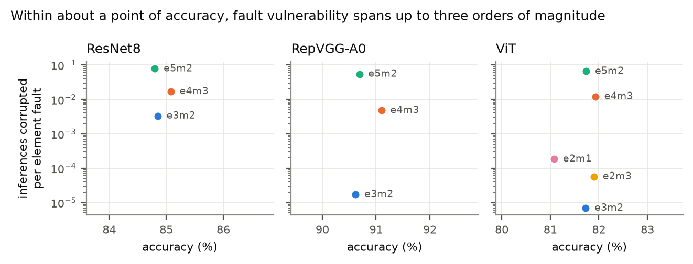
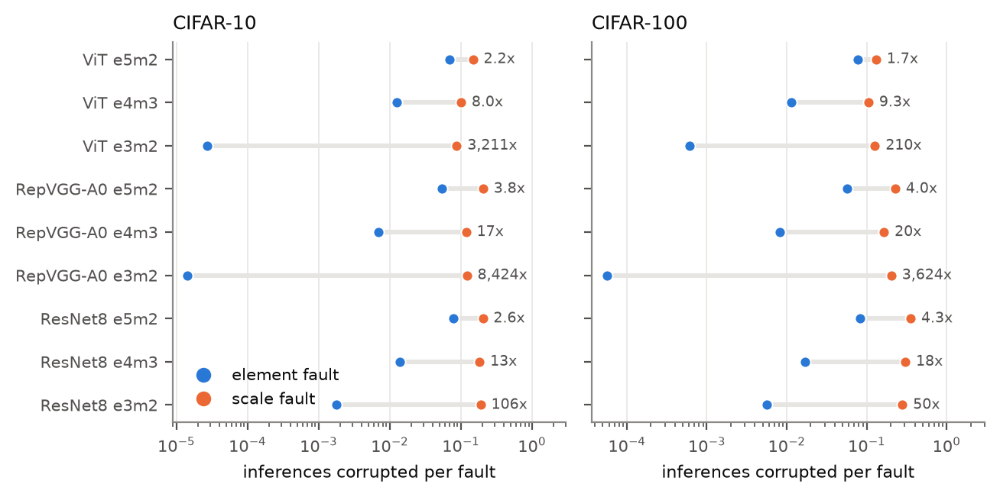
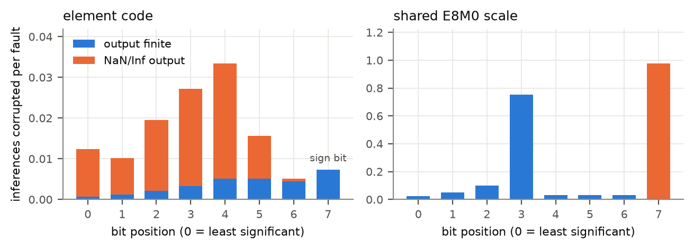
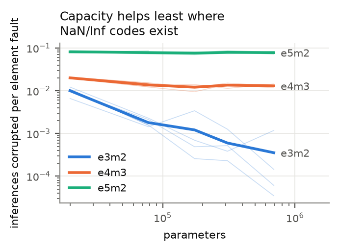
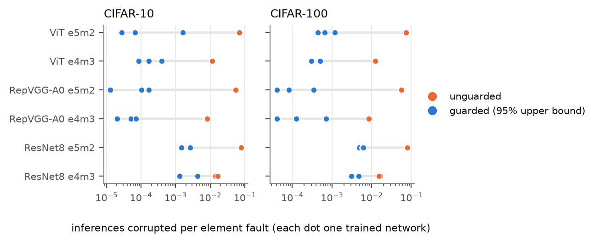
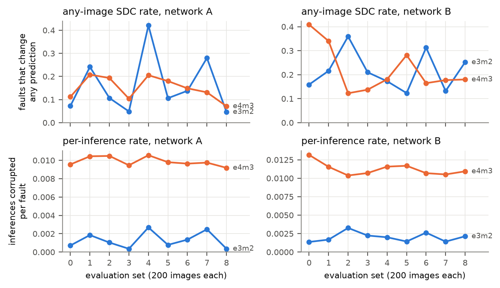
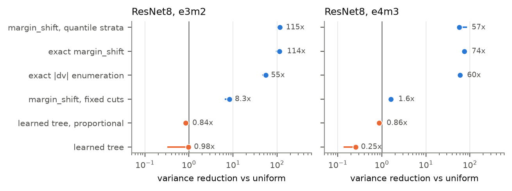

# Reliability-Aware Fault Injection for Microscaling-Based DNNs

A fault-injection study of deep neural networks quantised to the OCP Microscaling (MX)
formats, and `mxfi`, the bit-accurate injection library built for it.

**Peeyush Agarwal**, Department of Computer Science and Engineering, IIT Kanpur
CS496 Undergraduate Project, 2026

[Project report (PDF)](docs/report.pdf) · [Experiment log](docs/findings.md) · [Citation](#citation)

---

## Contents

1. [Overview](#overview)
2. [Main findings](#main-findings)
3. [Background](#background)
4. [Method](#method)
5. [Results](#results)
6. [Design guidance](#design-guidance)
7. [Repository structure](#repository-structure)
8. [Installation](#installation)
9. [Usage](#usage)
10. [Experiments](#experiments)
11. [Data and checkpoints](#data-and-checkpoints)
12. [Limitations](#limitations)
13. [Citation](#citation)

---

## Overview

Microscaling formats (MXFP8, MXFP6, MXFP4) store a tensor in blocks of K values, typically
32. Each value keeps a narrow 4 to 8 bit element code, and the whole block shares one 8-bit
power-of-two scale:

```
v[i] = decode(code[i]) * 2^(X - 127)
```

This makes low-precision inference cheap, but it changes the hardware fault model. In FP32 a
flipped bit damages one number. In MX a flip can land in an element code and change one value,
or in the shared scale and rescale all K values of the block at once.

This project measures what that means for real networks. It asks which formats, block sizes,
tensors, bit positions and layers are most vulnerable to bit faults when weights and
activations are stored in MX, and why. The central hypothesis is that reliability differs
substantially across formats even at equal accuracy, and that shared-scale faults behave very
differently from element faults.

The study covers three architectures (ResNet8, RepVGG-A0 and a DeiT-Tiny-width vision
Transformer), two datasets (CIFAR-10 and CIFAR-100), five element formats, four block sizes,
weights and activations, and every bit position. It runs more than three million injections
on over sixty independently trained networks. Two exhaustive campaigns, which flip every
stored bit of a ResNet8, provide exact ground truth.

## Main findings

All rates are per inference: the probability that a single fault corrupts a given
prediction.

1. Formats with the same accuracy differ in fault vulnerability by up to three orders of
   magnitude. The ordering e3m2 < e4m3 < e5m2 holds on every network tested, on both datasets.
2. A fault in the shared scale is always more damaging than a fault in an element, typically
   by 13x to more than 1000x. Scales are 2 to 11% of storage but can carry most of the damage.
3. Most element damage comes from flips that turn a value into NaN or infinity. Only the 8-bit
   formats have such codes. On the larger networks these flips are under 8% of element faults
   but carry 97 to 100% of element damage, and model capacity never absorbs them.
4. Decoding special element codes as zero on read removes this failure mode: element damage
   falls by at least 29x, and up to 4100x, on RepVGG-A0 and the Transformer.
5. The remaining damage follows the network's margin-normalised sensitivity, not the format's
   mantissa or exponent width.
6. Per fault, weights and activations are about equally dangerous. Larger blocks make scale
   faults rarer but worse and element faults milder.
7. The conventional "any image changed" SDC metric is confounded by near-tie inputs in the
   evaluation set. Exact enumeration of the MX code table makes campaigns 57 to 120x cheaper,
   and single-bit injection is sufficient.

## Background

### Element formats

| format | family | sign / exponent / mantissa | largest value | NaN/Inf codes |
|---|---|---|---|---|
| e4m3 | MXFP8 | 1 / 4 / 3 | 448 | 2 (NaN) |
| e5m2 | MXFP8 | 1 / 5 / 2 | 57,344 | 8 (2 Inf, 6 NaN) |
| e3m2 | MXFP6 | 1 / 3 / 2 | 28 | none |
| e2m3 | MXFP6 | 1 / 2 / 3 | 7.5 | none |
| e2m1 | MXFP4 | 1 / 2 / 1 | 6 | none |

The shared scale is always E8M0: an 8-bit power of two with bias 127, where code 255 is
reserved for NaN. Under the OCP rule the scale aligns the block maximum with the top binade of
the element format.

### Two fault sites

| site | width | effect of one flipped bit | blast radius |
|---|---|---|---|
| element code | 4 to 8 bits | one value changes; in e4m3 and e5m2 it may become NaN or Inf | 1 value |
| shared scale | 8 bits | every value in the block is multiplied by 2^(±2^j) for scale bit j | K values |

A flip of scale bit 7 moves the exponent by 128, past the float32 range. A flip that reaches
code 255 turns the whole block into NaN.

## Method

**Injection engine.** `mxfi` encodes each tensor into real MX bit patterns. Scales and element
codes are separate, addressable arrays, so a fault is an XOR of one bit into either site,
applied before decoding. Each element alphabet has at most 256 codes, so the decoded change of
every (code, bit) flip is also available as an exact lookup table. Networks are injected in
deployment form, with batch norm folded and RepVGG branches fused. Weights are blocked along the
reduction axis, as MX hardware reads them. NaN propagates through re-quantisation as the OCP
conversion specifies.

**Networks.**

| network | parameters | CIFAR-10 | CIFAR-100 | trained networks |
|---|---|---|---|---|
| ResNet8 (MLPerf Tiny) | 78K | 87.0% | 58% | 1 to 5 per configuration |
| ResNet8, widths 8 to 48 | 20K to 692K | 80.0 to 89.6% | | up to 10 per width |
| RepVGG-A0 (fused) | 7.0M | 91.4% | 70 to 71% | 3 per dataset |
| ViT, DeiT-Tiny width, depth 6 | 2.7M | 80.4 to 81.9% | 47 to 49% | 3 per dataset |

**Campaigns.** Each fault is scored on a fixed, class-balanced set of 200 test images against
the fault-free quantised network. Most campaigns draw 3000 faults uniformly over all stored
bits. The exhaustive ResNet8 campaigns (638,624 and 483,904 faults) validate the sampled
estimates: a 3000-fault campaign lands within 2.4% of the exact rate. Every campaign is tied to
the checkpoint that produced it by replaying recorded faults.

**Metric.** The per-inference rate is the mean, over faults, of the fraction of predictions
that change. The conventional any-image rate (did any of the 200 predictions change) saturates
and mostly measures whether the evaluation set contains a near-tie input, so it is not used for
comparisons.

## Results

### Equal accuracy, very different reliability



Within about one point of accuracy, element-fault damage spans more than two orders of
magnitude on ResNet8 and nearly four on RepVGG-A0 and the ViT.

| network (CIFAR-10, K = 32) | trained networks | e3m2 | e4m3 | e5m2 |
|---|---|---|---|---|
| RepVGG-A0 | 3 | 0.00001 | 0.00688 | 0.05381 |
| ViT | 3 | 0.00003 | 0.01258 | 0.06897 |
| ResNet8 | 1 | 0.00332 | 0.01699 | 0.07801 |
| ResNet8, width 8 | 5 | 0.01003 | 0.02005 | 0.08143 |
| ResNet8, width 16 | 5 | 0.00180 | 0.01374 | 0.07831 |
| ResNet8, width 48 | 4 | 0.00035 | 0.01302 | 0.07812 |

### Shared-scale faults dominate



In the exhaustive e3m2 campaign the scales are 4.1% of storage and carry 87.6% of all damage.
Scale flips that grow a block are catastrophic, while flips that shrink it are mild.

### NaN codes drive element damage



The sign bit does the most finite damage, but in e4m3 the 1.27% of element faults that flip a
code into the NaN pattern carry 77.6% of all element damage.



Across a 35x range of ResNet8 widths, capacity improves e3m2 (no special codes) 25x, e4m3 (two
codes) 1.5x, and e5m2 (eight codes) not at all.

### A read-side guard



Decoding special codes as zero on read costs one comparator in hardware. Each dot is one
trained network.

### Measurement methodology



One fault list replayed on nine evaluation sets. Under the any-image metric e3m2 and e4m3 look
equal and swap order between sets. Per inference they differ 5.6x and 7.6x, stable across sets.



Stratifying on exact per-code enumeration, weighted by gradient sensitivity, reduces variance
57 to 120x against uniform sampling. Intervals learned from a pilot, as in TreeFI, do not beat
uniform sampling on these formats.

Further figures (block size, CIFAR-100, weights against activations, multi-bit faults,
sensitivity) are in [`docs/figures`](docs/figures). The full analysis is in the
[report](docs/report.pdf).

## Design guidance

For MX accelerator designers:

1. Protect the shared scale first. Parity or ECC on scale bytes is the cheapest protection with
   the largest payoff. If only some scale bits can be protected, protect those normally at 0.
2. Prefer element formats without NaN/Inf codes, or decode special element codes as zero on read.
3. Do not use accuracy or bit width as a proxy for reliability.
4. Treat block size as a trade-off; with protected scales, large blocks are safe.
5. Allocate protection by vulnerability rather than storage: the small stem layer is the most
   fragile.

For fault-injection campaigns on MX models: report the per-inference rate, replicate over
several independently trained networks, inject single-bit faults, and stratify by exact
per-code enumeration.

## Repository structure

```
mxfi/            the library
  formats.py       exact element alphabets, E8M0 scale
  codec.py         MX encode/decode, OCP and non-clipping scale rules
  faults.py        two-site fault model, exact impact tables
  torch_mx.py      PyTorch wrapper with fast single- and multi-bit injection
  sampling.py      uniform and stratified fault sampling
  stats.py         Wilson intervals, stratified estimators
  campaign.py      golden-versus-faulty campaign driver
  models.py, vit.py, data.py, train.py
experiments/     one script per experiment (e00 to e24) and the figure scripts
tests/           unit tests (214)
tools/           GPU support and checkpoint/campaign verification
scripts/         batch runners used for the long CPU and GPU campaigns
results/         raw campaign outputs from CPU runs
checkpoints/     networks trained on CPU, with per-epoch training logs
cluster/         networks, results and logs from the GPU server
data/            CIFAR-10 and CIFAR-100
docs/            report, figures, experiment log
papers/          problem-statement documents
study_guide/     long-form explanatory guide (LaTeX)
```

## Installation

Requires Python 3.11 or later and [Git LFS](https://git-lfs.com) (three dataset files exceed
GitHub's file-size limit).

```bash
git lfs install
git clone https://github.com/peeyushagarwal2004/CS496_UGP.git
cd CS496_UGP
python -m venv .venv
.venv/Scripts/python -m pip install -r requirements.txt --extra-index-url https://download.pytorch.org/whl/cpu
.venv/Scripts/python -m pytest tests -q
```

On Linux or macOS use `.venv/bin/python`. For GPU runs install a CUDA build of PyTorch instead
of the CPU wheel.

## Usage

The library works on plain numpy arrays:

```python
import numpy as np
from mxfi import quantize, Fault, inject

x = np.random.randn(4, 128).astype(np.float32)
q = quantize(x, "e4m3", block_size=32)

inject(q, Fault("element", (0, 0, 0), 7)).decode()   # changes 1 value
inject(q, Fault("scale",   (0, 0),    7)).decode()   # changes 32 values
```

Training a network and running a campaign (from the repository root, with `PYTHONPATH=.`):

```bash
python -m mxfi.train --model resnet8 --epochs 60
python -m experiments.e01_uniform_baseline --model resnet8 --fmt e4m3
```

A model name ending in `_c100` (for example `vit_small_c100`) uses CIFAR-100. Add
`--device cuda` to run on a GPU. Figures are regenerated with
`python -m experiments.make_figures` and `python -m experiments.make_report_figures`, and the
report with `pdflatex report.tex` (twice) in `docs/`.

## Experiments

Each script's docstring states what it tests and how to run it.

| script | question |
|---|---|
| `e00_quantized_accuracy` | quantised accuracy across formats, block sizes and scale rules |
| `e01_uniform_baseline` | uniform 3000-fault weight campaign for one configuration |
| `e02_stratified` | stratified against uniform allocation at equal budget |
| `e03_block_size`, `e03b_block_size_matched` | block size as an efficiency/reliability trade-off |
| `e04_activations` | weight against activation fault sensitivity |
| `e05c_near_ties` | near-tie inputs and the any-image SDC metric |
| `e06_exhaustive` | exhaustive fault injection (ground truth) |
| `e08` to `e11` | why formats of equal width differ: geometry, perturbation size, margins, sensitivity |
| `e12_severity_metrics` | severity measures against observed failure |
| `e14`, `e16` | origin of the sensitivity tail |
| `e15`, `e20` | value-aware sampling against exhaustive ground truth |
| `e17`, `e18` | how much of a failure rate belongs to the evaluation set |
| `e19_per_inference` | every campaign scored per inference |
| `e21_multibit` | single-bit against multi-bit faults |
| `e22_learned_vs_exact` | learned value intervals against exact per-code enumeration |
| `e23_nan_guard` | read-side NaN guard |
| `e24_cifar100` | replication on CIFAR-100 |
| `width_sweep_analysis`, `width_sweep_multiseed` | model capacity across ResNet8 widths |

## Data and checkpoints

The repository tracks every raw campaign output, every trained network and the datasets.
`results/` and `checkpoints/` hold the CPU runs; `cluster/` holds the GPU server's networks,
results and logs. The two are kept apart because training is not bit-reproducible across
machines: same-named checkpoints from the two machines hold different weights, and a campaign
is only valid against the checkpoint in its own tree. `tools/verify_ground_truth.py` checks this
by replaying recorded faults. See [`cluster/README.md`](cluster/README.md).

## Limitations

ImageNet was not available on the compute used, so a ViT trained from scratch on CIFAR-100 stands
in for DeiT on ImageNet. The largest network has 7M parameters. Only faults in stored values
(weights, activations and their scales) are modelled, with every bit equally likely to flip, and
the NaN guard is evaluated in software.

## Citation

```bibtex
@misc{agarwal2026mxfi,
  author       = {Peeyush Agarwal},
  title        = {Reliability-Aware Fault Injection for Microscaling-Based {DNNs}},
  year         = {2026},
  howpublished = {CS496 Undergraduate Project, Indian Institute of Technology Kanpur},
  url          = {https://github.com/peeyushagarwal2004/CS496_UGP}
}
```

## Acknowledgements

I thank my supervisor for the problem statement and guidance, and IIT Kanpur for access to its
GPU server.
