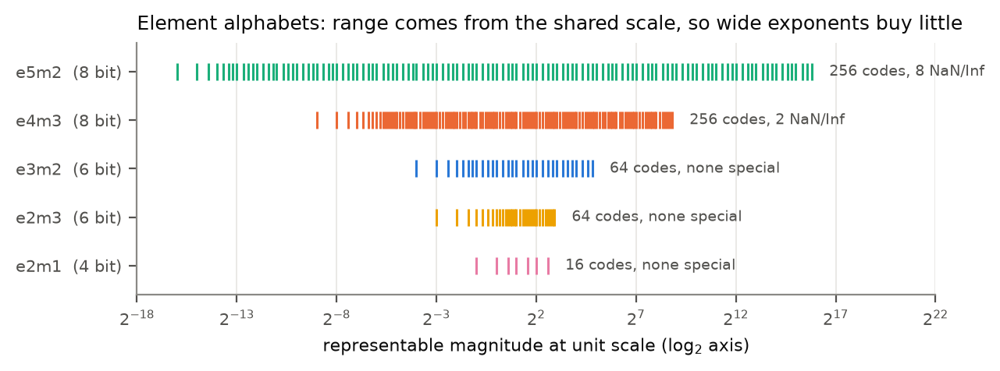
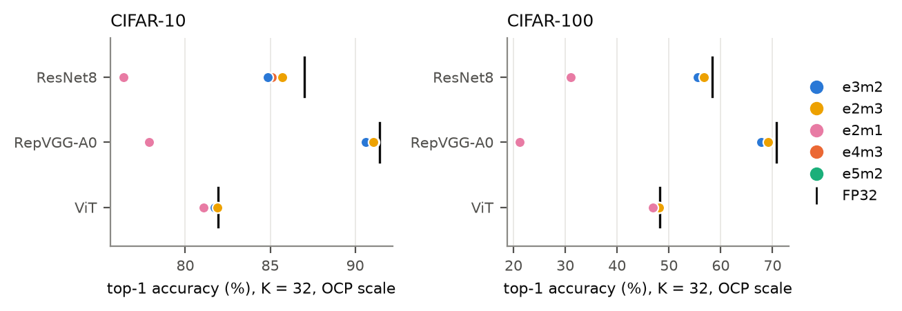
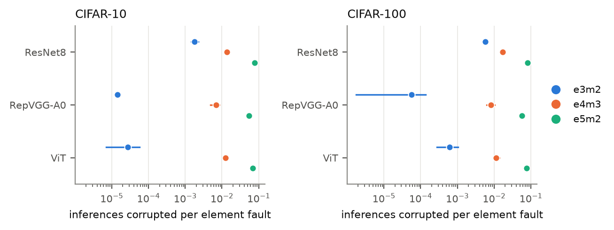
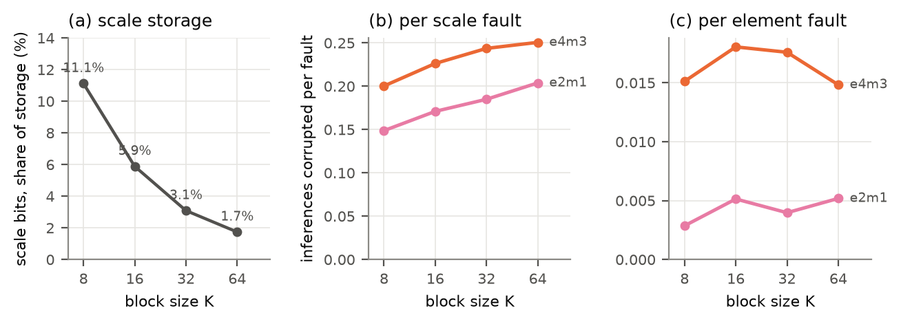
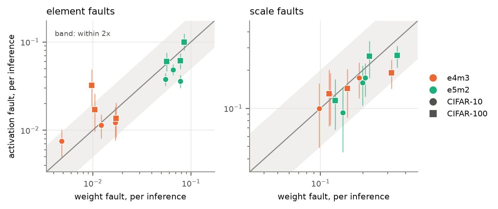
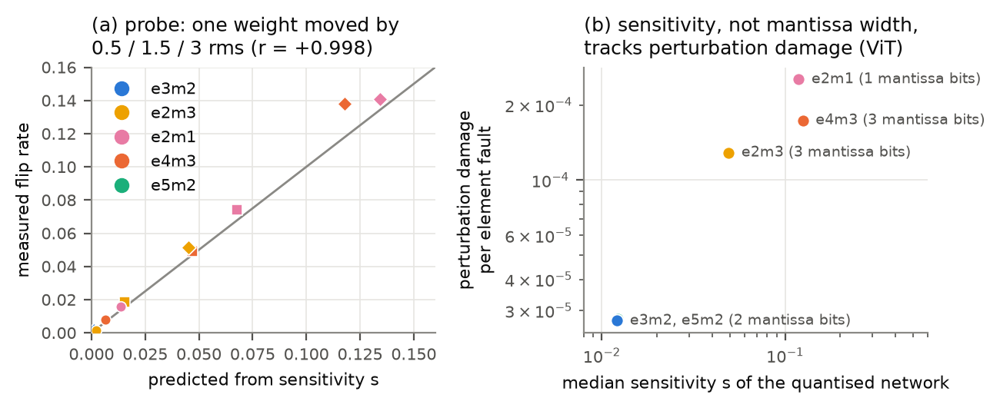
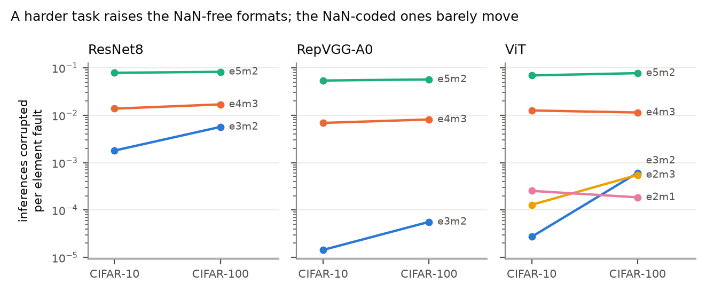
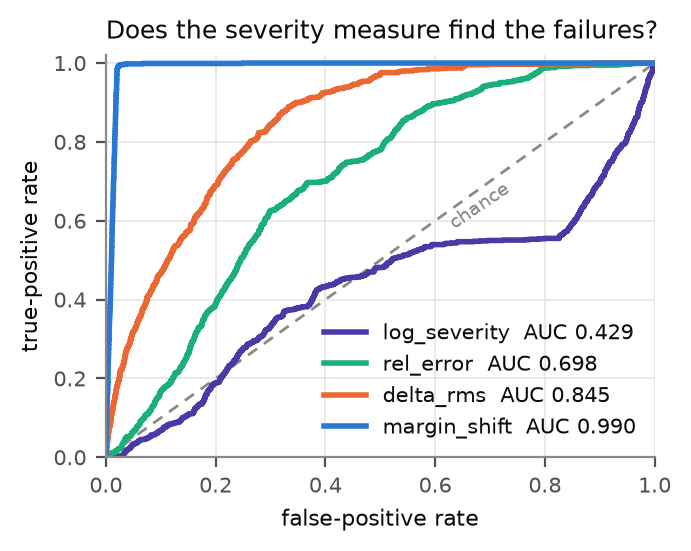
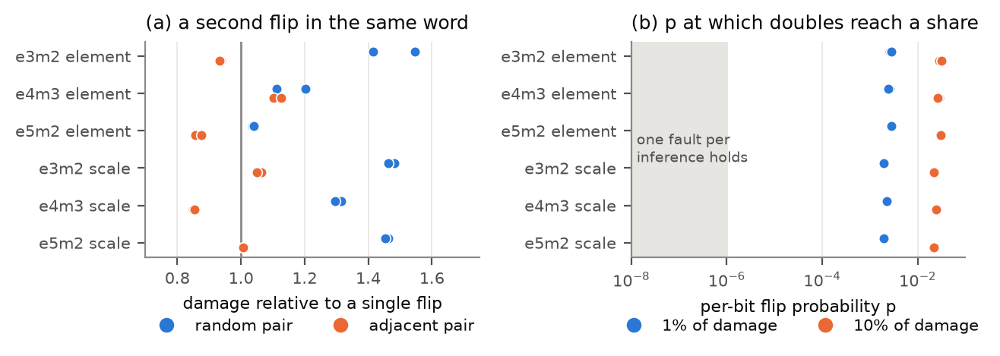

# Reliability-Aware Fault Injection for Microscaling-Based DNNs

Peeyush Agarwal, Department of Computer Science and Engineering, IIT Kanpur
CS496 Undergraduate Project, 2026

Report: [docs/report.pdf](docs/report.pdf) (8 pages)

## Abstract

Microscaling (MX) formats store a deep neural network's weights and activations in blocks of
K narrow 4 to 8 bit elements that share one 8-bit power-of-two scale. They make low-precision
inference cheap, but they also change the fault model. A bit flip can land in one element,
where it corrupts one value, or in a shared scale, where it rescales all K values of the block
at once. This project characterises how reliable MX networks are under such faults.

The study uses `mxfi`, a bit-accurate fault-injection library that encodes tensors into real
MX bit patterns, flips bits at either fault site and measures the effect on a network's
predictions. More than three million injections were run on ResNet8, RepVGG-A0 and a small
vision Transformer, trained on CIFAR-10 and CIFAR-100, across five element formats, four block
sizes, weights and activations, and every bit position. Two exhaustive campaigns, which flip
every stored bit of a ResNet8, provide exact ground truth for validating every sampled
estimate.

Formats with the same accuracy differ in fault vulnerability by up to three orders of
magnitude, and the ordering e3m2 < e4m3 < e5m2 holds on all 17 networks measured. A fault in a
shared scale is always more damaging than one in an element, typically by 13x to more than
1000x. The dominant mechanism is the NaN and infinity codes of the 8-bit formats: on the larger
networks the 1 to 8% of element faults that land on such a code carry 97 to 100% of all element
damage, model capacity never absorbs them, and decoding them as zero on read cuts element
damage by 29x to over 4000x. The remaining damage follows the network's decision margins, not
its mantissa width. The project also shows that the conventional "any image changed" SDC metric
is confounded by near-tie inputs, gives a severity measure that predicts failures at AUC 0.99
and cuts campaign cost by 57 to 120x, and shows that single-bit injection with exact
enumeration of the MX code table is the right methodology for these formats.

## 1. Problem statement

### 1.1 Microscaling formats

An MX tensor is split into blocks of K consecutive values (usually K = 32). Each block stores
one shared scale X in the E8M0 encoding (an 8-bit power of two, code 255 reserved for NaN) and
K element codes:

```
v[i] = decode(code[i]) * 2^(X - 127)
```

The scale supplies the dynamic range and the element supplies the precision. The OCP MX v1.0
specification defines five element formats:

| format | family | sign/exp/mantissa | largest value | NaN/Inf codes |
|---|---|---|---|---|
| e4m3 | MXFP8 | 1/4/3 | 448 | 2 (NaN) |
| e5m2 | MXFP8 | 1/5/2 | 57,344 | 8 (2 Inf, 6 NaN) |
| e3m2 | MXFP6 | 1/3/2 | 28 | none |
| e2m3 | MXFP6 | 1/2/3 | 7.5 | none |
| e2m1 | MXFP4 | 1/2/1 | 6 | none |



Because the shared scale already provides range, a block's values occupy only the top few
binades of the element format. The wide exponents of the 8-bit formats are largely unused, but
their reserved NaN and infinity codes remain reachable by a single bit flip.

### 1.2 Two fault sites

In FP32 every value is a self-contained word, so a flipped bit damages one number. MX breaks
this assumption, because a flip can land at two structurally different sites:

| site | width | effect of one flipped bit | blast radius |
|---|---|---|---|
| element code | 4 to 8 bits | one value changes; may become NaN/Inf in e4m3/e5m2 | 1 value |
| shared scale | 8 bits | every value in the block is multiplied by 2^(±2^j) for scale bit j | K values |

Flipping scale bit 7 moves the exponent by 128, beyond the float32 range, and reaching code 255
turns the whole block into NaN. Scales are only about 3% of storage at K = 32, but if every
stored bit is equally likely to flip, an 8-bit format receives about half of its corrupted
values through them.

### 1.3 Hypothesis and objectives

The hypothesis under test is that the reliability of MX networks varies substantially across
formats even at comparable accuracy, and that faults in the shared scale behave very
differently from faults in individual elements. The study has five objectives:

| | objective |
|---|---|
| O1 | Characterise how element and shared-scale faults propagate, and quantify the difference. |
| O2 | Measure fault sensitivity across MX formats and test whether it differs at equal accuracy. |
| O3 | Determine how block size trades efficiency against reliability. |
| O4 | Compare weights with activations, and fault locations (scale vs element bit, MSB vs LSB, layer). |
| O5 | Identify the representation characteristics that explain vulnerability. |

Two methodological questions are settled empirically: whether fault impact should be
characterised by learned value intervals (as TreeFI does for FP32) or by exact enumeration of
the MX code table, and whether single-bit injection suffices or multi-bit upsets need their own
campaigns.

## 2. Method

### 2.1 The `mxfi` library

`mxfi` encodes a tensor into an `MXTensor` whose two fault sites are separate, addressable
`uint8` arrays (`scales[..., n_blocks]` and `codes[..., n_blocks, K]`). A fault is an XOR of one
bit into one of them, applied before decoding, so a scale fault perturbs all K values and an
element fault can land on a NaN code exactly as in hardware. The core (formats, codec, fault
model, sampling, statistics) is plain numpy; a separate layer wraps PyTorch models. Because an
element alphabet has at most 256 codes, the decoded change of every (code, bit) flip is
tabulated in closed form, which later serves as an exact severity table. The library has 214
unit tests.

Networks are injected in their deployment form: batch norm folded into convolutions and RepVGG
branches fused. Weights are blocked along the reduction axis, as MX hardware reads them.
Following the OCP conversion, a NaN anywhere in a block makes the whole block NaN, so a NaN
created by an activation fault propagates through re-quantisation.

### 2.2 Networks

| network | parameters | CIFAR-10 accuracy | CIFAR-100 accuracy | seeds |
|---|---|---|---|---|
| ResNet8 (MLPerf Tiny) | 78K | 87.0% | 58% | 1 to 5 |
| ResNet8, widths 8 to 48 | 20K to 692K | 80.0 to 89.6% | | up to 10 per width |
| RepVGG-A0 (fused) | 7.0M | 91.4% | 70 to 71% | 3 |
| ViT (DeiT-Tiny width, depth 6) | 2.7M | 80.4 to 81.9% | 47 to 49% | 3 |

After MX quantisation at K = 32 the 6- and 8-bit formats are matched in accuracy on every
network (within 0.2 points of FP32 on the ViT), so reliability can be compared at equal
accuracy.



### 2.3 Campaigns and metrics

Each fault is scored on a fixed, class-balanced set of 200 test images against the fault-free
quantised network. Most campaigns draw 3000 faults uniformly over every stored bit. Two
exhaustive campaigns flip all 638,624 (e4m3) and 483,904 (e3m2) weight bits of a ResNet8; a
3000-fault estimate lands within 2.4% of the exhaustive rate, inside its confidence interval.

The primary metric is the **per-inference rate**: the average, over faults, of the fraction of
inferences whose prediction changes. It answers the question a system designer asks: given one
fault, how likely is a particular inference to be wrong? The conventional any-image SDC rate
(did any of the N predictions change) is reported only where its failure is the point
(Section 4.1).

Every campaign is tied to the exact checkpoint that produced it by a replay check, since
networks trained from the same seed on different hardware reach the same accuracy with
different weights.

## 3. Results

### O2: equal accuracy, very different reliability


Within about one point of accuracy, the per-inference damage of an element fault spans more
than two orders of magnitude on ResNet8 and nearly four on RepVGG-A0 and the ViT. On the ViT,
e5m2 and e3m2 differ by 0.01 points of accuracy, while an e5m2 element fault is about 2000
times as likely to corrupt a given inference.

| network (CIFAR-10, K = 32) | seeds | e3m2 | e4m3 | e5m2 |
|---|---|---|---|---|
| RepVGG-A0 | 3 | 0.00001 | 0.00688 | 0.05381 |
| ViT | 3 | 0.00003 | 0.01258 | 0.06897 |
| ResNet8 | 1 | 0.00332 | 0.01699 | 0.07801 |
| ResNet8, width 8 | 5 | 0.01003 | 0.02005 | 0.08143 |
| ResNet8, width 16 | 5 | 0.00180 | 0.01374 | 0.07831 |
| ResNet8, width 48 | 4 | 0.00035 | 0.01302 | 0.07812 |

The ordering e3m2 < e4m3 < e5m2 holds on all 8 CIFAR-10 configurations, with disjoint 95%
intervals, and on all 9 CIFAR-100 networks.



### O1: shared-scale faults dominate


A scale fault is more damaging than an element fault in every network and format, by 1.7x to
over 8000x. In the exhaustive e3m2 campaign the scale bytes are 4.1% of storage and carry 87.6%
of all damage; in e4m3 they are 3.1% and carry 32.7%. About 12% of scale faults produce a
non-finite output in every format, because E8M0 has its own NaN code. Scale flips that grow a
block are catastrophic (bit 3, which multiplies the block by 256, corrupts 75% of inferences;
bit 7 overflows it, 98%), while flips that shrink it are mild (3%).

### O3: block size



Larger blocks shrink the scale's share of storage from 11.1% (K = 8) to 1.7% (K = 64), make each
scale fault worse, and make element faults milder. The two sites move in opposite directions,
so block size is a genuine trade-off; with protected scales, large blocks are safe. A
matched-fault experiment confirms the element-side trend under both the OCP and a non-clipping
scale rule.

### O4: bit position, layer, and tensor type


Among faults that leave the output finite, the sign bit is the most damaging element bit. In
total damage it ranks seventh of eight in e4m3, because the 1.27% of element faults that flip a
code into the NaN pattern `S.1111.111` corrupt every inference and carry 77.6% of all element
damage, and a sign flip can never reach that pattern. Vulnerability runs opposite to layer
size: the small stem convolution is the most fragile layer.



Per fault, weights and activations are about equally dangerous (0.3 to 2.2x), for the same
reason: about 1% of faults in either land on a special code. They differ in exposure, since a
weight fault persists across inferences and an activation fault lives for one.

### O5: what drives vulnerability


The first driver is the NaN and infinity codes. Across a 35x range of ResNet8 widths with up
to ten seeds per width, capacity improves e3m2 (no special codes) 25x, e4m3 (two) 1.5x and
e5m2 (eight) not measurably. The fraction of element faults that produce NaN/Inf stays flat
with width, while its share of all failures rises, because capacity absorbs ordinary
perturbations but never a NaN. On RepVGG-A0 and the ViT, special-code faults carry 97 to 100%
of e4m3 and e5m2 element damage.



The second driver governs the remaining perturbation damage: the network's margin-normalised
sensitivity `s = |dm/dw| * rms / m`, where m is the top-1/top-2 logit margin. It predicts a
format-agnostic weight-perturbation probe at r = +0.998 and perturbation damage across formats
at r = +0.93, while mantissa width does not (r = -0.25). The spread of s across formats comes
from the margin of the evaluation image closest to a decision boundary, not from the gradients,
which agree across formats to within 1.08x.

### A read-side guard for special codes


Decoding any special element code as zero on read turns a NaN-producing fault into a single
zeroed weight. On RepVGG-A0 and the ViT this cuts element damage by at least 29x and up to
4100x, bringing e5m2 to the level of e3m2; on ResNet8, which is also fragile to ordinary
perturbations, by 4 to 53x. No guarded fault produced a non-finite output. In hardware the
guard is one comparator on the read path.

### CIFAR-100



Every result replicates on CIFAR-100, which stands in for ImageNet. With smaller margins the
NaN-free formats become 3 to 22x more vulnerable while e4m3 and e5m2 barely move, so the gap
between formats narrows (on the ViT, from 461x to 19x). The advantage of NaN-free formats is
smallest on the harder tasks real deployments face.

### Summary by objective

| objective | answer |
|---|---|
| O1 propagation | A scale fault is always more damaging than an element fault, typically 13x to over 1000x. |
| O2 formats | Equal-accuracy formats differ by up to three orders of magnitude; e3m2 < e4m3 < e5m2 everywhere. |
| O3 block size | Larger blocks make scale faults rarer but worse and element faults milder; a genuine trade. |
| O4 tensor and location | Weights and activations equally dangerous per fault; NaN transitions dominate the element bits; the stem layer is most fragile. |
| O5 drivers | NaN/Inf codes first; then the network's margin-normalised sensitivity, not mantissa width. |

## 4. Methodological findings

### 4.1 The any-image SDC metric measures the evaluation set


One fixed fault list, replayed against nine disjoint sets of 200 images on two networks: under
the any-image metric e3m2 and e4m3 look equal and swap order between sets; per inference they
differ 5.6x and 7.6x, stable to within 1.3x across sets. The any-image rate saturates and mostly
reports whether the set contains a near-tie input (Spearman +0.89 with the near-tie count over
39 networks). Separately, two networks differing only in their training seed differ by a median
12.8x the injection uncertainty, so results must be replicated over trained networks, not only
over injections.

### 4.2 A severity measure that predicts failure



The log-ratio severity `|log v' - log v|` scores a sign flip as zero and ranks failures below
chance (AUC 0.435). `margin_shift = s * |v' - v| / rms`, the fraction of the decision margin a
fault consumes, reaches AUC 0.990; flagging `margin_shift > 1` catches 98.5% of failures in 4.4%
of the fault space.

### 4.3 Value-aware sampling


The per-inference target is zero-inflated (92% of e3m2 element faults corrupt nothing).
Stratifying at quantiles of `margin_shift` with Neyman allocation reduces variance 57 to 120x
against uniform sampling, replayed against exhaustive ground truth: 3000 stratified injections
are as precise as 171,000 to 346,000 uniform ones. Exact enumeration of the decoded change alone
gives 48 to 65x, while TreeFI-style intervals learned from a pilot never beat uniform sampling,
because a pilot cannot see the zero-inflated tail and the e4m3 tail is a discrete set of NaN
transitions rather than a value range.

### 4.4 Single-bit injection is sufficient



Injecting every single and double flip of 2000 words per format on two networks (390,000
injections), a double flip does 1.04 to 1.55x the damage of a single flip and an adjacent pair
0.85 to 1.13x. Within-word doubles reach 1% of expected damage only at a per-bit flip
probability of 2 to 3 x 10^-3, three orders of magnitude beyond where the one-fault-per-inference
assumption of any campaign holds.

## 5. Design guidance

For MX accelerator designers:

1. Protect the shared scale first. It is 2 to 11% of storage and does 13x to over 1000x the
   damage of an element fault; if only some scale bits can be protected, protect those normally
   at 0, whose flips grow the block.
2. Neutralise special codes: prefer element formats without NaN/Inf codes, or decode special
   element codes as zero on read.
3. Do not judge reliability by accuracy or bit width.
4. Treat block size as a trade-off; with protected scales, large blocks are safe.
5. Protect by vulnerability, not storage size: the small stem layer is the most fragile.

For fault-injection campaigns on MX models: report the per-inference rate, replicate over
several trained networks, inject single-bit faults, stratify by exact per-code enumeration
weighted by gradient sensitivity, tie every campaign to its checkpoint, and inject the
deployment form of the network.

## 6. Limitations

ImageNet was not available on the compute used, so CIFAR-100 with a ViT trained from scratch
at DeiT-Tiny width stands in for DeiT on ImageNet; it tests the conclusions on a harder task
with smaller margins but is not a measurement at ImageNet scale. The largest network has 7M
parameters, and small language models and MXINT8 are not covered. Only faults in stored values
(weights, activations and their scales) are modelled, with every bit equally likely to flip.
Campaigns score a fixed subset of 200 images, and the NaN guard is evaluated in software.

## Repository layout

| path | contents |
|---|---|
| `mxfi/` | the library: formats, codec, fault model, sampling, statistics, PyTorch wrapper, models, training, campaign runner |
| `experiments/` | one script per experiment (`e00` to `e24`); each docstring states what it tests and how to run it |
| `tests/` | unit tests (`pytest`, 214 tests) |
| `tools/` | GPU support and checks that a recorded campaign belongs to a given checkpoint |
| `results/` | raw campaign outputs from CPU runs |
| `cluster/` | checkpoints, results and logs from the GPU server, kept separate because same-named checkpoints from the two machines hold different weights |
| `checkpoints/` | trained networks from CPU runs, with per-epoch training logs |
| `data/` | CIFAR-10 and CIFAR-100 |
| `docs/` | the report, its figures, and the full experiment log (`findings.md`) |
| `papers/` | the problem statement documents |

## Reproducing

Clone with [Git LFS](https://git-lfs.com) installed, otherwise the three largest dataset files
come down as pointer files.

```bash
python -m venv .venv
.venv/Scripts/python -m pip install -r requirements.txt --extra-index-url https://download.pytorch.org/whl/cpu
.venv/Scripts/python -m pytest tests -q
```

On Linux or macOS use `.venv/bin/python`. Set `PYTHONPATH=.` when running from the repository
root. Then, for example:

```bash
python -m mxfi.train --model resnet8 --epochs 60
python -m experiments.e01_uniform_baseline --model resnet8 --fmt e4m3
python -m experiments.make_figures
python -m experiments.make_report_figures
```

A model name ending in `_c100` (e.g. `vit_small_c100`) uses CIFAR-100. The heavier runs used
`--device cuda` on an NVIDIA A100. The report builds with `pdflatex report.tex` (run twice) in
`docs/`.

The library on its own:

```python
import numpy as np
from mxfi import quantize, Fault, inject

x = np.random.randn(4, 128).astype(np.float32)
q = quantize(x, "e4m3", block_size=32)

inject(q, Fault("element", (0, 0, 0), 7)).decode()   # changes 1 value
inject(q, Fault("scale",   (0, 0),    7)).decode()   # changes 32 values
```

## References

1. B. D. Rouhani et al., "Microscaling data formats for deep learning," arXiv:2310.10537, 2023.
2. Open Compute Project, "OCP Microscaling Formats (MX) Specification, Version 1.0," 2023.
3. G. Li et al., "Understanding error propagation in deep learning neural network (DNN) accelerators and applications," SC 2017.
4. A. Mahmoud et al., "PyTorchFI: A runtime perturbation tool for DNNs," DSN Workshops 2020.
5. R. Leveugle et al., "Statistical fault injection: Quantified error and confidence," DATE 2009.
6. TreeFI: value-aware statistical fault injection for DNNs, ICCAD 2026.
7. X. Ding et al., "RepVGG: Making VGG-style ConvNets great again," CVPR 2021.
8. H. Touvron et al., "Training data-efficient image transformers & distillation through attention," ICML 2021.
